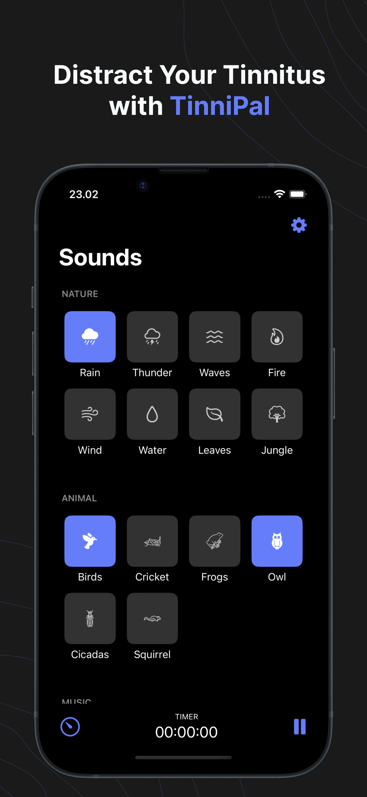
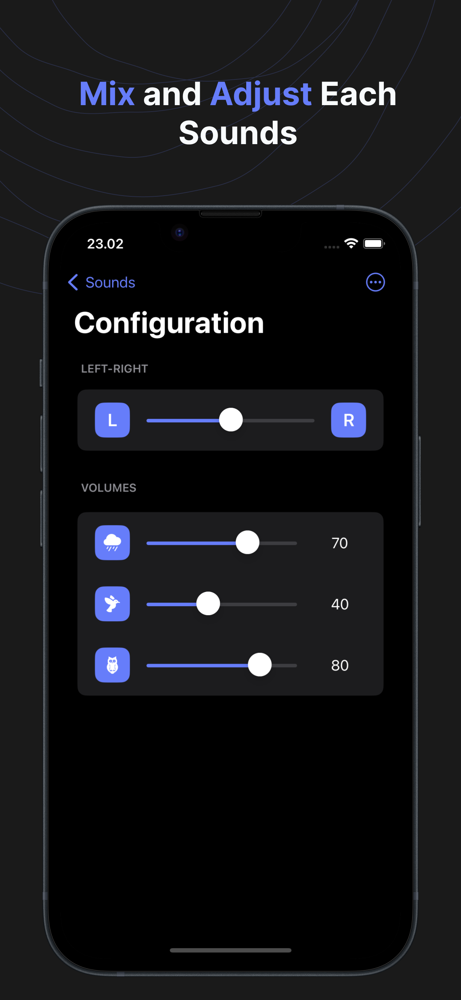
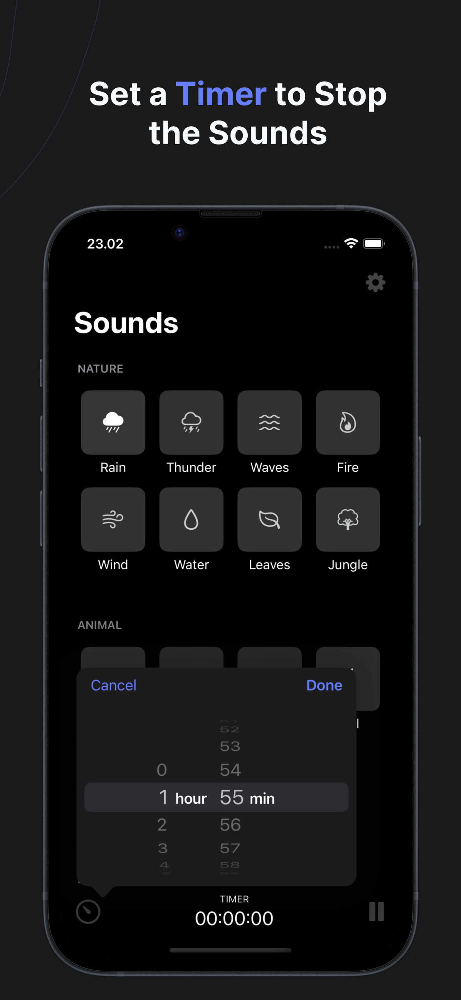
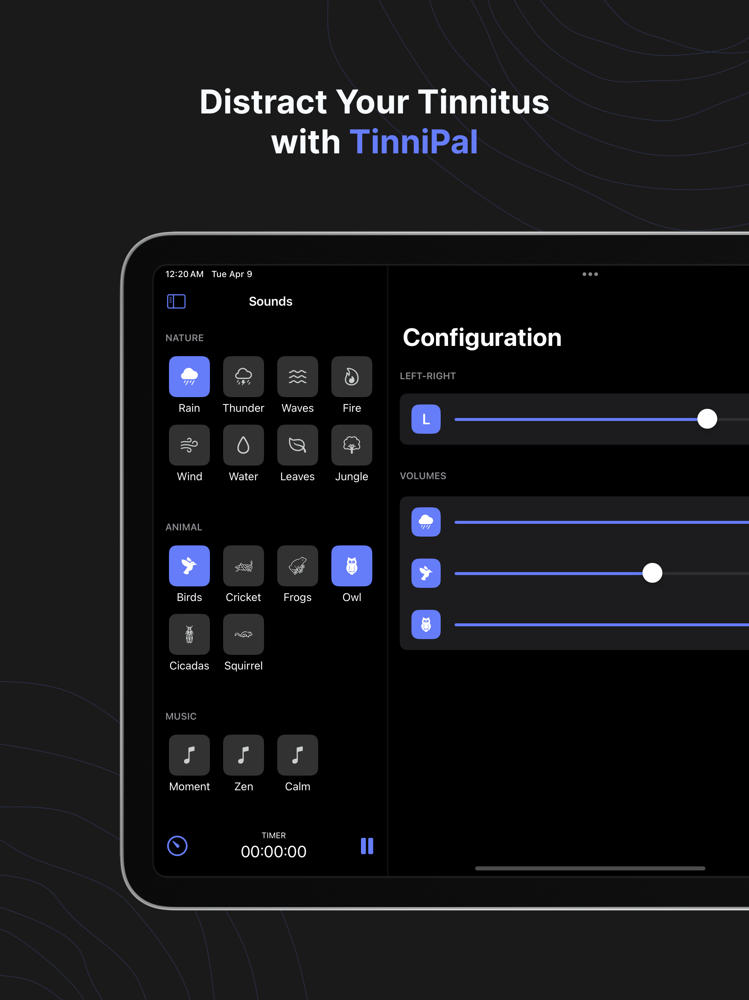
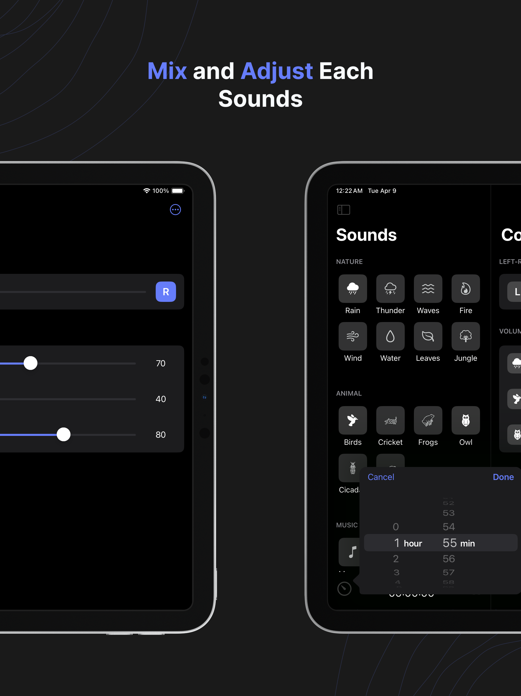
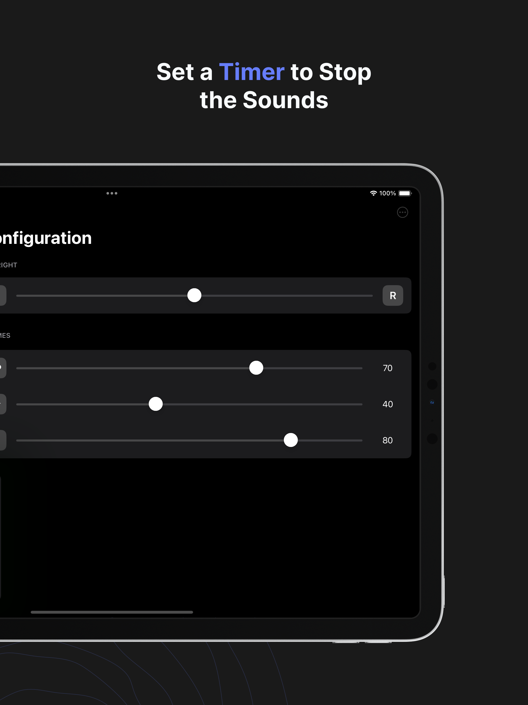

# TinniPal
<a href="https://apps.apple.com/us/app/tinnipal/id6483106989?itscg=30200&amp;itsct=apps_box_appicon" style="width: 60px; height: 60px; border-radius: 22%; overflow: hidden; display: inline-block; vertical-align: middle;"></a>

**TinniPal** is a sound mask app to help tinnitus sufferers get distracted from their tinnitus and make it less noticeable. This app is equipped with natural sounds library, where user can get distracted from the tinnitus ringing and get relaxed or calm at the same time. 


**TinniPal** has various natural sounds library, you can create your own personalized soundscape that suit you with choosing and play several sounds at the same time. You can also configure volume for each sound, by these features you can personalized your own preferable soundscape. There are also left-right stereo output feature that you may can adjust, where we know that not every tinnitus sufferers hear tinnitus in both ears. And don’t worry to fall asleep or forget to turn off the playing sounds, because there is a timer feature that you can set for how long you want to hear the sounds.

# Get It Now
<a href="https://apps.apple.com/us/app/tinnipal/id6483106989?itsct=apps_box_badge&amp;itscg=30200" style="display: inline-block; overflow: hidden; border-radius: 13px; width: 250px; height: 83px;"></a>

# Build With
* SwiftUI
* AVFoundation/AVFAudio
* Combine Framework
* MVVM Architectural Pattern

# Demo
### Iphone
|                                                |                                                |                                                |
| :--------------------------------------------: | :--------------------------------------------: | :--------------------------------------------: |
|  |  |  |

### Ipad
|                                                |                                                |                                                |
| :--------------------------------------------: | :--------------------------------------------: | :--------------------------------------------: |
|  |  |  |

# Credits
* Sounds by [Pixabay](https://pixabay.com/sound-effects/)
* Icons by [SVGRepo](https://www.svgrepo.com)

# License
```
MIT License

Copyright (c) 2024 Ferry Dwianta P

Permission is hereby granted, free of charge, to any person obtaining a copy
of this software and associated documentation files (the "Software"), to deal
in the Software without restriction, including without limitation the rights
to use, copy, modify, merge, publish, distribute, sublicense, and/or sell
copies of the Software, and to permit persons to whom the Software is
furnished to do so, subject to the following conditions:

The above copyright notice and this permission notice shall be included in all
copies or substantial portions of the Software.

THE SOFTWARE IS PROVIDED "AS IS", WITHOUT WARRANTY OF ANY KIND, EXPRESS OR
IMPLIED, INCLUDING BUT NOT LIMITED TO THE WARRANTIES OF MERCHANTABILITY,
FITNESS FOR A PARTICULAR PURPOSE AND NONINFRINGEMENT. IN NO EVENT SHALL THE
AUTHORS OR COPYRIGHT HOLDERS BE LIABLE FOR ANY CLAIM, DAMAGES OR OTHER
LIABILITY, WHETHER IN AN ACTION OF CONTRACT, TORT OR OTHERWISE, ARISING FROM,
OUT OF OR IN CONNECTION WITH THE SOFTWARE OR THE USE OR OTHER DEALINGS IN THE
SOFTWARE.
```
